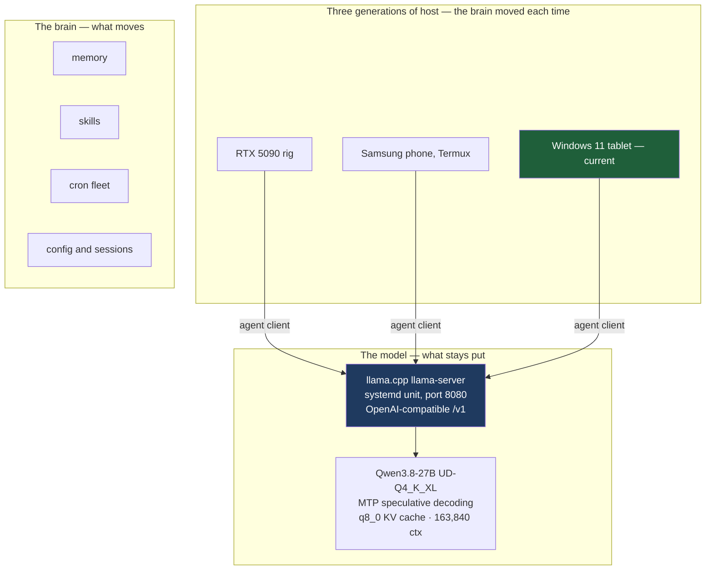

# aiduh-deployment

How the AI assistant "Aiduh" (Hermes Agent) is deployed and has been
migrated across three generations of hardware — an RTX 5090 rig, a
Samsung phone (Termux), and a Windows 11 tablet — all talking to one
llama.cpp LLM server on a home PC.

The central thesis: the *brain* (memory, skills, cron fleet, config)
moves between machines; the LLM server stays put. The agent is a
**client** of the model, not its host — which is what makes a phone or a
tablet viable as an always-on agent platform.

## How it is deployed



The split is the point. Because the agent is a **client** of the model rather than its host, the
brain can live on a phone or a tablet while a 17.9 GB model stays on the GPU machine — which is what
makes an always-on agent viable on hardware that could never run the model itself.

Restart discipline is in the repo too: `verify.sh` for post-restart health checks, and
`benchmark_tps.sh` to confirm the server came back at expected speed rather than merely answering.

## What's in this repo

| File | Purpose |
|------|---------|
| `llama-server.service` | systemd unit serving Qwen3.8-27B (Q4_K_XL GGUF) as an OpenAI-compatible API on `0.0.0.0:8080` — flash attention, MTP speculative decoding, q8_0 KV cache, 163,840-token context |
| `verify.sh` | post-restart health/service/model/port checks |
| `benchmark_tps.sh` | 3-run tokens-per-second benchmark (run ON the server host) |
| `token-speed-test.py` | Python TPS benchmark at multiple token lengths (local, no network) |
| `HISTORY.md` | the full deployment history — all three hosts, all model generations, operating lessons |

## Serving stack (home PC, Ubuntu)

```
llama.cpp (build/bin/llama-server)
  └── systemd service, port 8080, OpenAI-compatible /v1
        └── clients on the tailnet:
              ├── Windows 11 tablet (current Hermes home)
              └── (historically) Samsung phone / Termux
```

Tuning highlights (Qwen3.8-27B UD-Q4_K_XL, ~17.9 GB):

- `--ctx-size 163840` — matches the Hermes `context_length`; the model
  is trained for 262,144 but VRAM sets the practical ceiling.
- `--spec-type draft-mtp --spec-draft-n-max 6` — native MTP draft
  heads; large speedup on Qwen3.x.
- `--cache-type-k q8_0 --cache-type-v q8_0` — quantised KV cache to buy
  context headroom.
- `--flash-attn on` — VRAM reduction, required at this context size.
- `--sleep-idle-seconds 300` — offloads VRAM after 5 min idle.

## Restart discipline

```bash
sudo systemctl daemon-reload
sudo systemctl restart llama-server.service
# wait 20-30s, then:
./verify.sh
```

A restart drops the agent for ~30-60 seconds while the model reloads.
That is expected, not a failure.

## Hermes-side config (client)

The agent's `config.yaml` points a `custom` provider at the server:

```yaml
model:
  provider: custom
  default: /home/joshua/llama.cpp/models/.../Qwen3.8-27B-UD-Q4_K_XL.gguf
  base_url: http://<home-pc-tailnet-ip>:8080/v1
```

**Pitfall:** llama.cpp ignores the requested model name and serves the
loaded file — the Hermes `default` field must be the full GGUF path or
the UI shows a model that doesn't exist.

## Licensing

MIT + [The Commons Clause](LICENSE) — free to use; if you make money
from it, share back.
